# 🍽️ EasyServe – Canteen Preorder App

**EasyServe** is a smart canteen preorder app that helps students and staff save time by allowing them to place food orders before arriving at the canteen. No more long queues or delays – just order, pick up, and enjoy!

---

## 🚀 Features

- 🔐 User authentication (Sign Up & Login)
- 📱 Browse menu and daily specials
- 🛒 Add items to cart and preorder
- ⏰ Schedule pick-up time
- 📦 Track order status in real-time
- 💳 Online payment options
- 📊 Admin dashboard for managing orders and menu
- 📲 Fully responsive design for mobile, tablet, and desktop

---

## 🛠️ Tech Stack

**Frontend**  
- React.js  
- Tailwind CSS  
- Context API (for state management)

**Backend**  
- Node.js  
- Express.js  
- MongoDB (Mongoose for ODM)  

---

## 🔗 Live Preview

Explore the live versions of EasyServe:

- 👥 [User Site](https://easy-serve-frontend.vercel.app) – Place orders, track status, and enjoy food on time  
- 🛠️ [Admin Panel](https://easy-serve-admin.vercel.app) – Manage orders, menus, and scheduling

## 🖼️ Screenshots

### 👥 User Interface

Experience the seamless flow from login to order placement and tracking:

#### 🔐 User Login
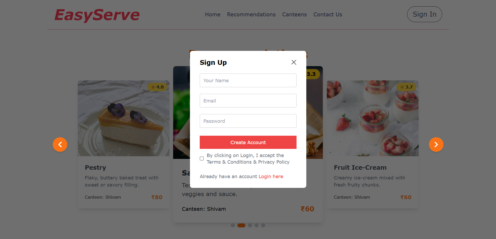

#### 🎯 Recommendations Page
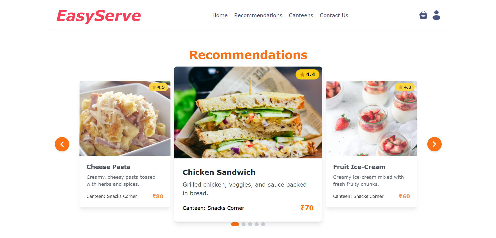

#### 🏪 Canteen Selection
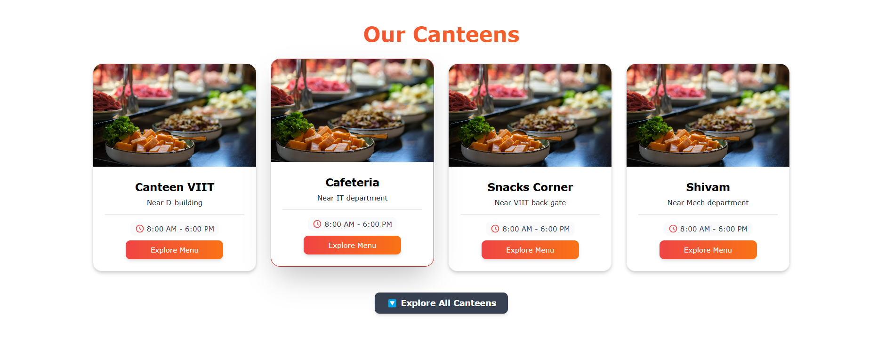

#### 🍽️ Menu Display
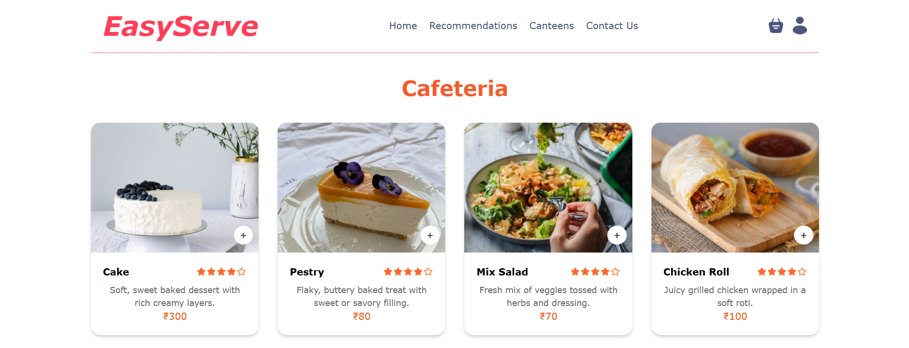

#### 🛒 Cart Page
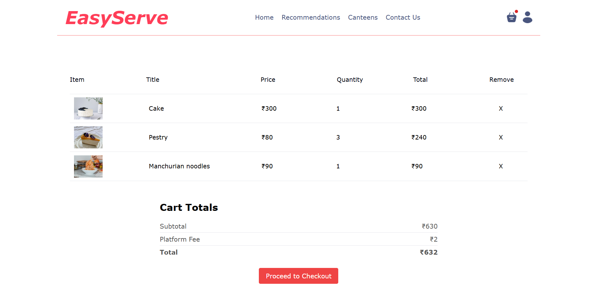

#### 📦 Place Order
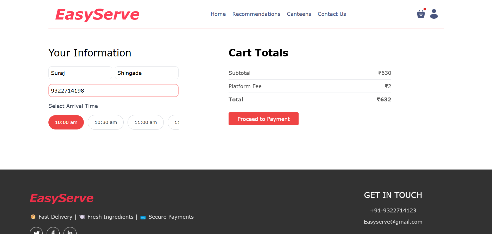

#### 💳 Payment Page
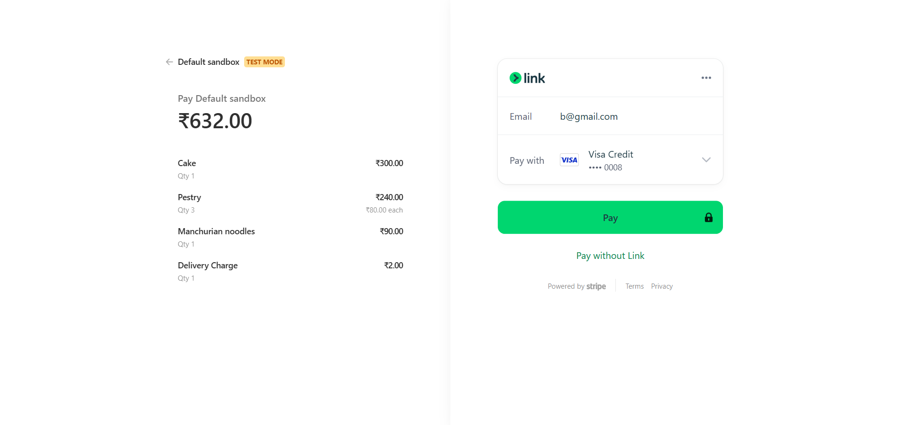

#### 📜 My Orders
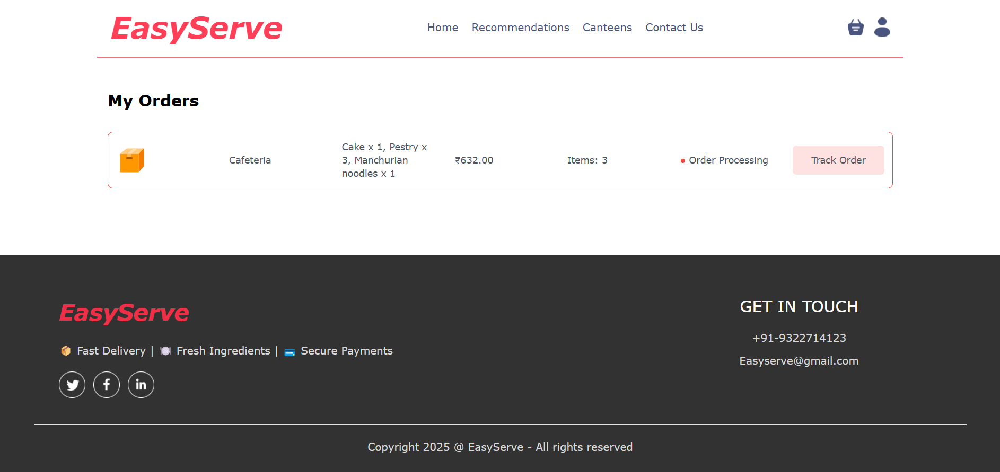

#### 🔻 Footer Section
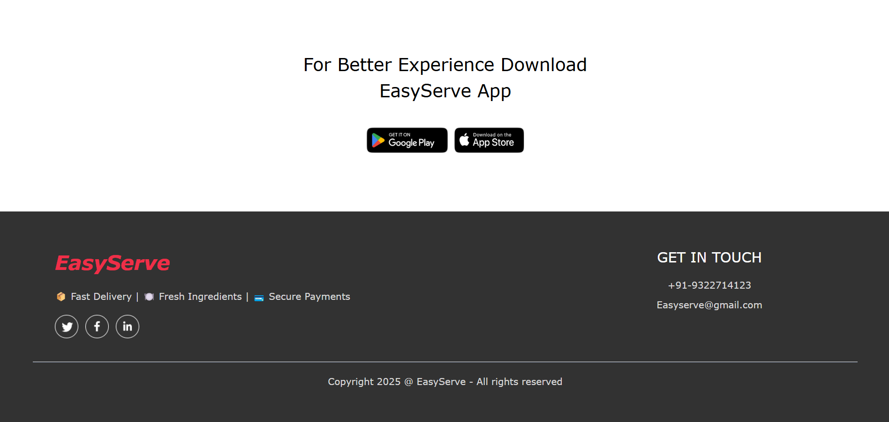

---

### 🛠️ Admin Dashboard

Manage orders and menu with ease from the admin panel:

#### 🔐 Admin Login
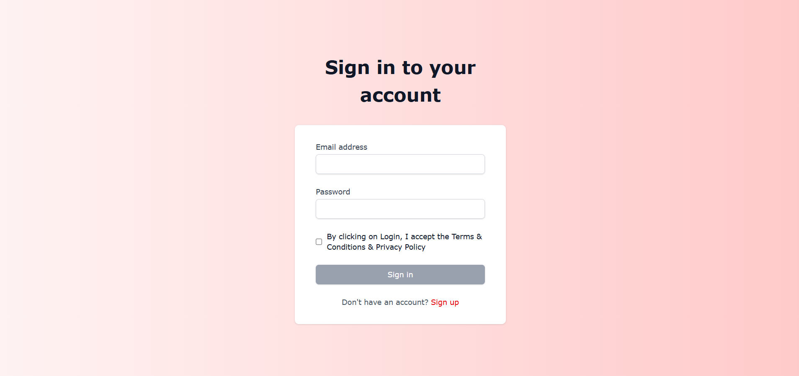

#### ➕ Add New Menu Item
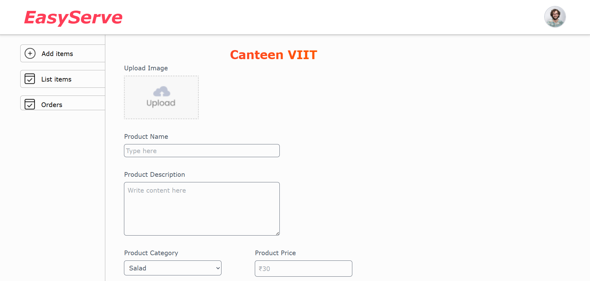

#### 📋 View Menu List
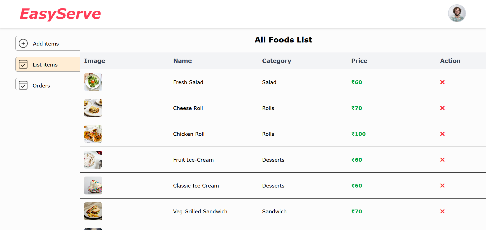

#### 📦 Order Management Page
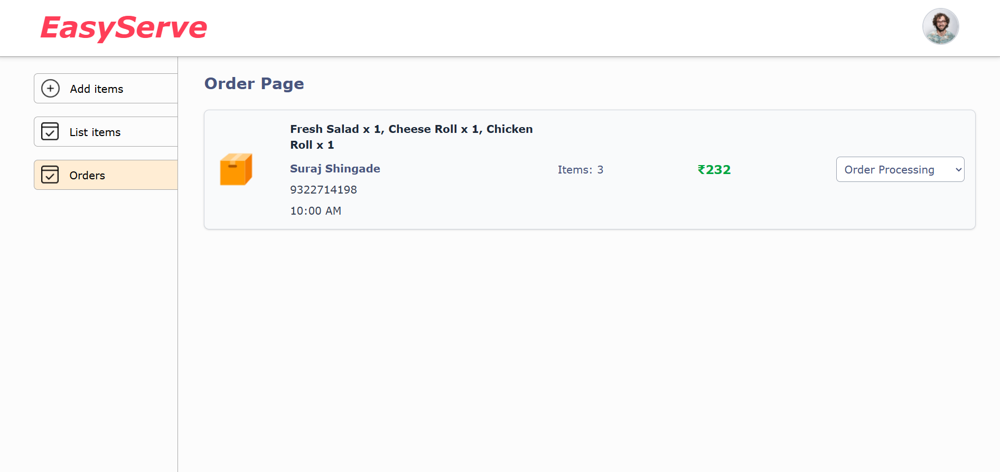
